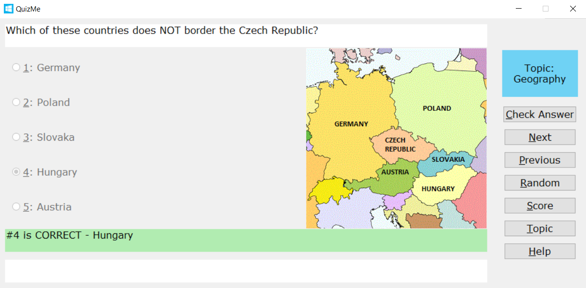

# quizme

This program generates an interactive quiz based on questions and answers defined in a JSON document. I wrote it to learn about how to create a dynamic data-driven GUI with Tkinter.

Compatibility/Prerequisites:

* Requires Python 3.x. I've only tested on 3.4 and 3.5, but it doesn't use any new features from those releases. The Tkinter stuff uses the syntax changes from Python 3.0 and up.
* On Windows, there are no other dependencies - all you need is a recent Python installation.
* On Mac OS X, you need to manually install the latest version of ActiveTcl (because it isn't installed by default with Python). Follow the instructions here: [https://www.python.org/download/mac/tcltk](https://www.python.org/download/mac/tcltk)
* I've not tested on Linux, but it should work fine as long as you have Python 3.x and Tkinter/Tcl is installed.

Basic Concepts:

* When you launch the program, you're prompted to select a quiz. The quizzes are defined in JSON files, and a few simple samples are provided in the *data* folder, along with an *_empty_template.json* file that you can use as a starting point to create new quizzes.
* A quiz may optionally include images, and there are images used for some questions in the sample quizzes. The *image* entry in the JSON file points to an image to be displayed along with the question, and the *answerimage* entry points to an image to be displayed after the question has been answered. See the sample quizzes for examples.
* The only supported image format at this time is *gif*. This is a Tkinter constraint, and the Pillow module could be used to add support for more image formats if desired.
* There are options to move through the questions, select a random question, change topics, and so on. See the *Help* button for more info on the UI.

Here's a screenshot of a question that has been correctly answered, in Windows 10:

